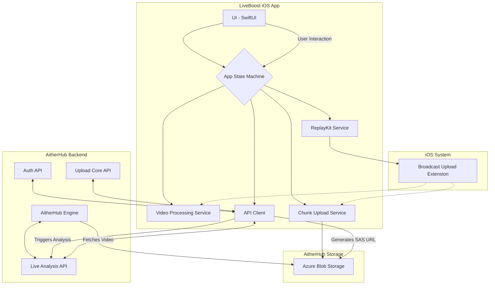
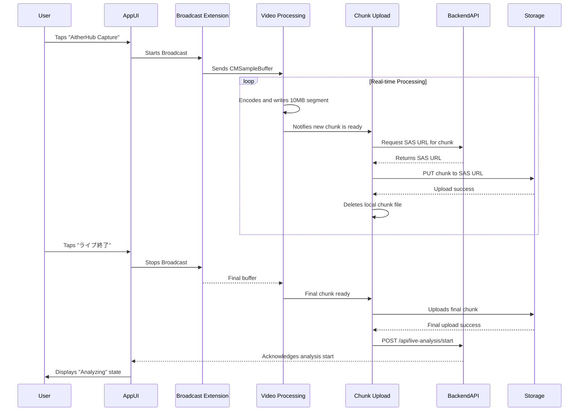

# LiveBoost Companion App - Architecture Design

**Author:** Manus AI
**Date:** 2026-03-08

## 1. Overview

This document outlines the architecture for the **LiveBoost Companion App**, an iOS MVP designed to streamline the post-live analysis workflow for TikTok streamers using the AitherHub platform. The app's primary purpose is to serve as a **live commerce data acquisition tool**. It automates the process of recording a live stream, uploading the video, and initiating analysis on the AitherHub backend.

The core objectives are:

-   **One-Tap Recording:** Start screen recording with a single tap.
-   **Automated Workflow:** Automatically upload the recording and trigger the AitherHub analysis pipeline upon completion of the live stream.
-   **Stability and Efficiency:** Ensure stable, long-duration screen capture (e.g., 3+ hours) and efficient handling of large video files (e.g., 10GB+).

This document adheres to the user's directive: *"The Live Boost App will become the data collection infrastructure for the Live Commerce Data OS, so please design it with an extensible structure."*

## 2. System Architecture

The overall system consists of three main parts: the LiveBoost iOS App, the AitherHub Backend, and AitherHub Storage (Azure Blob Storage).



| Component | Technology/Framework | Responsibility |
| :--- | :--- | :--- |
| **UI** | SwiftUI | Provides a single-screen interface with a primary button and status indicators. |
| **App State Machine** | Swift (Enum) | Manages the app's five states: `Idle`, `Recording`, `Uploading`, `Analyzing`, `Completed`. |
| **ReplayKit Service** | ReplayKit | Initiates and manages the screen recording session via the Broadcast Upload Extension. |
| **Video Processing** | AVFoundation (AVAssetWriter) | Receives raw video/audio samples from ReplayKit and performs real-time H.264/AAC encoding. |
| **Chunk Upload Service**| URLSession | Manages the chunking of the encoded video file (e.g., 10MB segments) and uploads them to storage. |
| **API Client** | URLSession, Combine | Handles all communication with the AitherHub Backend, including authentication and job submission. |
| **Broadcast Extension** | ReplayKit (RPBroadcastSampleHandler) | Runs as a separate process to capture screen samples and pass them to the main app for processing. |

## 3. Component Design

### 3.1. UI and State Management (SwiftUI)

The UI will be a single view with a central button. The button's text and the view's state will be driven by a state machine.

-   **States:**
    -   `Idle`: Default state. Button shows "AitherHub Capture".
    -   `Recording`: Recording is active. Button shows "ライブ終了" (End Live).
    -   `Uploading`: Uploading chunks. UI shows progress.
    -   `Analyzing`: Upload complete, analysis job submitted. UI shows "解析中" (Analyzing).
    -   `Completed`: Analysis finished (or a terminal state is reached). UI shows completion status.

### 3.2. Screen Recording (ReplayKit)

We will use an **In-App Broadcast Extension** (`RPBroadcastSampleHandler`). This is crucial for stability, as it runs in a separate process from the main app. The main app will only be responsible for starting and stopping the broadcast.

1.  **Start:** The main app presents the `RPSystemBroadcastPickerView` to the user, who selects the LiveBoost extension to begin broadcasting.
2.  **Sample Handling:** The `RPBroadcastSampleHandler` extension receives `CMSampleBuffer` objects for video and audio. It will not write to a file directly. Instead, it will pass these samples to the main app's container via App Groups.
3.  **Stop:** The user taps "ライブ終了" in the main app, which signals the extension to finish the broadcast.

### 3.3. Video Encoding (AVAssetWriter)

The `VideoProcessingService` within the main app will:

1.  Receive `CMSampleBuffer`s from the broadcast extension.
2.  Initialize an `AVAssetWriter` with H.264 video and AAC audio output settings.
3.  Append samples to the writer in real-time, creating a compressed video file in the app's temporary cache directory.
4.  The video will be written in segments to facilitate the chunking process.

### 3.4. Chunk Upload Service

This service is critical for handling large files without consuming excessive memory.

1.  **Chunking:** As the `AVAssetWriter` finalizes a video segment (e.g., every 10MB), the `ChunkUploadService` is notified.
2.  **SAS URL Request:** For each chunk, the `APIClient` requests a unique upload SAS URL from the AitherHub Backend (`POST /api/v1/videos/generate-upload-url`). The filename will be structured to represent the chunk order (e.g., `video_id/chunk_001.mp4`, `video_id/chunk_002.mp4`).
3.  **Upload:** The service uses `URLSession` to `PUT` the chunk to the provided SAS URL.
4.  **Concurrency:** The service will manage a queue of upload operations, potentially uploading multiple chunks in parallel to maximize bandwidth.
5.  **Cleanup:** Once a chunk is successfully uploaded, its local file is deleted to free up space.

### 3.5. Backend API Client

This client will encapsulate all interactions with the AitherHub Backend.

-   **Authentication:** It will manage the AitherHub JWT, storing it securely (e.g., Keychain) and refreshing it when necessary. All requests will include the `Authorization: Bearer <token>` header.
-   **Endpoints:**
    -   `POST /api/v1/auth/login`: To authenticate the user.
    -   `POST /api/v1/videos/generate-upload-url`: To get a SAS URL for each video chunk.
    -   `POST /api/live-analysis/start`: A **new endpoint** to be created. This signals the backend that all chunks for a given `video_id` have been uploaded and the analysis process should begin.

## 4. Data and Workflow

### 4.1. Recording & Upload Flow



### 4.2. Backend API Specification (`/api/live-analysis/start`)

This new endpoint is required to orchestrate the server-side workflow.

-   **Endpoint:** `POST /api/live-analysis/start`
-   **Authentication:** Required (AitherHub JWT)
-   **Request Body:**

    ```json
    {
      "video_id": "string",
      "user_id": "string",
      "stream_source": "tiktok_live_ios_companion",
      "total_chunks": "integer"
    }
    ```

-   **Backend Logic:**
    1.  Receives the request.
    2.  Verifies that all `total_chunks` for the given `video_id` exist in storage.
    3.  If verified, concatenates the chunks into a single video file in a processing directory.
    4.  Enqueues a job for the **AitherHub Engine** with the path to the reassembled video.
    5.  Returns a `202 Accepted` response to the client.

## 5. Storage and Security

-   **Local Storage:** All video data will be stored exclusively within the app's sandboxed cache directory (`Library/Caches`). **No data will be saved to the user's Camera Roll.** All local files will be deleted immediately after successful upload.
-   **Authentication:** User identity will be managed via AitherHub's existing JWT-based authentication system.
-   **Upload Security:** All uploads will use short-lived SAS URLs generated on-demand by the backend. This ensures the client never needs direct access to storage account keys.

## 6. Extensibility

The proposed architecture is designed for future expansion:

-   **Modular Services:** Each core function (recording, encoding, uploading) is a separate service, allowing for independent updates or replacement.
-   **Flexible API Client:** The `APIClient` can be easily extended to support new backend endpoints for features like real-time comment ingestion or viewer count tracking.
-   **State-Driven UI:** The UI is decoupled from the business logic, making it simple to add new states or visual indicators for future features like "CTA Proposal Ready".
-   **Backend-Driven Workflow:** The final analysis trigger is a simple API call, allowing the complex backend workflow (chunk concatenation, analysis pipeline) to evolve without requiring app updates.

This design establishes a robust and scalable foundation for the LiveBoost app, positioning it as a key data collection component for the future Live Commerce Data OS.
